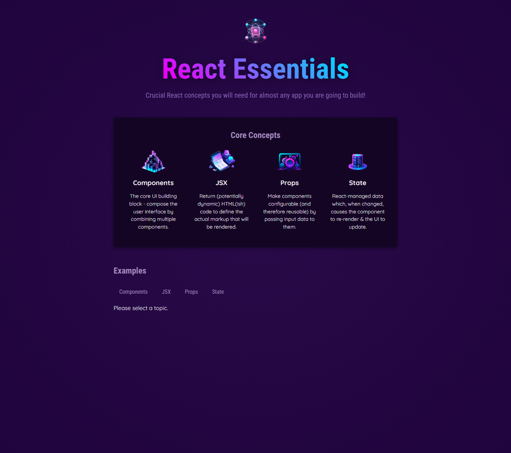
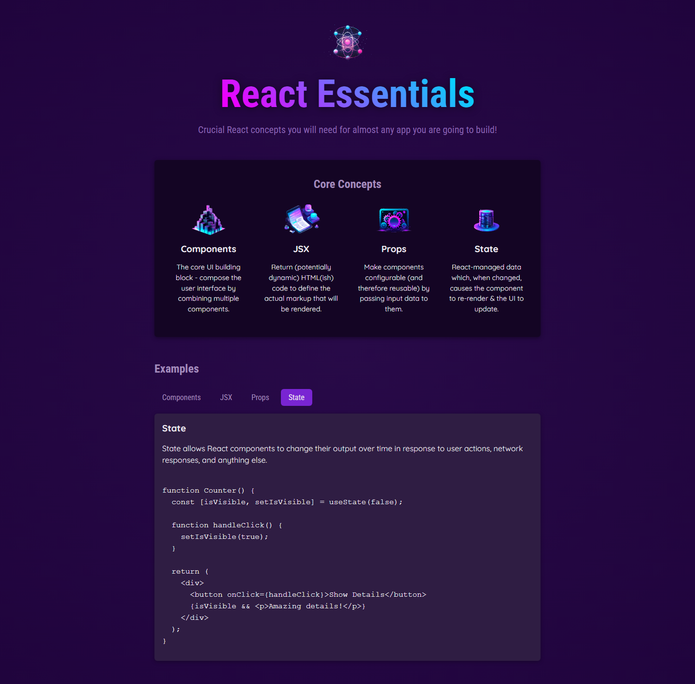

# React Essentials Demo

A small React learning app that shows the core concepts every beginner meets first: components, JSX, props, and state.



## Features

- Core concept cards with short explanations
- Interactive examples for components, JSX, props, and state
- Simple Vite + React setup
- Custom favicon that matches the React learning theme

## Screenshots



## Tech Stack

- React
- Vite
- JavaScript
- CSS

## Getting Started

```bash
npm install
npm run dev
```

Open the local URL printed in the terminal.

## Build

```bash
npm run build
```

## License

This project is for learning and practice.
